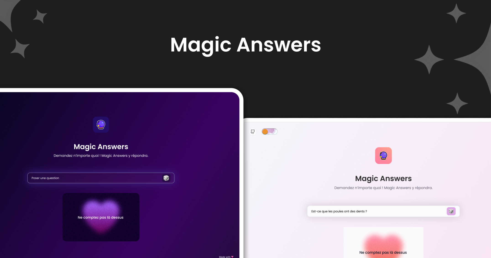

# 🔮 Magic Answers

> [!NOTE]
> 🥖 Unlike my other projects, this one is entirely in French and is intended only for French-speaking readers.

## In French

> [!IMPORTANT]
> Le code du projet est aussi hébergé sur mon instance GitLab personnalisée, accessible à [cette adresse](https://git.florian-dev.fr/floriantrayon/Magic-Answer). Le dépôt GitHub est un miroir du dépôt GitLab, **mis à jour automatiquement**.
>
> **Les contributions publiques restent sur GitHub et sont les bienvenues** ; les pull requests validées y seront ensuite transférées manuellement sur GitLab pour être intégrées. 🙂

### Introduction

Impressionnés par le livre du même nom, [Magic Answers](https://www.amazon.com/Magic-Answers-Book-Collectif/dp/2492847136), nous avons souhaité créer un site Internet (nom de code : **MAW**) reprenant le même principe : poser une question et obtenir une réponse aléatoire parmi une liste de réponses préenregistrées, suffisamment vagues pour être interprétées de différentes façons et ainsi s'adapter à un grand nombre de questions. ✨

Ce projet est le fruit du travail de deux personnes : [Claire](https://www.linkedin.com/in/claire-math%C3%A9-ux-ui-designer-%E2%9C%AE/), en charge de la partie graphique, de l'ergonomie et de l'expérience utilisateur, et moi-même, [Florian](https://www.linkedin.com/in/florian-trayon/), responsable du développement. Nous nous sommes efforcés de [concevoir un site Internet simple, rapide et accessible à tous](.gitlab/images/figma.png), en utilisant des technologies Web modernes. Il est construit avec [SvelteKit](https://svelte.dev/docs/kit/introduction) et [Vite](https://vite.dev/), stylisé avec [TailwindCSS](https://tailwindcss.com/), utilise [TypeScript](https://www.typescriptlang.org/) pour améliorer la maintenabilité du code et respecte les bonnes pratiques du développement Web. 💖

Concernant l'accessibilité, nous avons veillé à ce que le site Internet soit utilisable par tous, y compris les personnes en situation de handicap. Nous avons choisi des couleurs contrastées ainsi que la police [Luciole](https://luciole-vision.com/), créée par l'Université Lumière Lyon 2 et spécialement conçue pour les personnes malvoyantes. Les animations et effets visuels sont automatiquement désactivés en fonction des préférences utilisateur, et le site Internet est entièrement navigable au clavier et compatible avec les lecteurs d'écran. 🫶

Dans une démarche de sobriété numérique, ce site Internet est conçu pour être servi depuis n'importe quel serveur Web : les fichiers sont générés statiquement une seule fois puis distribués via [GitLab Pages](https://docs.gitlab.com/user/project/pages/), ce qui contribue à réduire son empreinte carbone. Nous avons également pris soin de limiter les dépendances aux seules réellement nécessaires, d'optimiser les images et de réduire le nombre de requêtes HTTP. Bien que perfectible, cette approche vise à minimiser l'impact environnemental du site Internet. 🌱

Enfin, le site Internet ne contient ni cookies, ni technologies de suivi, ni publicité, et ne collecte aucune donnée personnelle. Il est entièrement gratuit et accessible à tous, sans aucune restriction. 🥸

### Installation

> [!WARNING]
> Le déploiement en environnement de production nécessite un serveur Web déjà configuré comme [Nginx](https://nginx.org/en/), [Apache](https://httpd.apache.org/) ou [Caddy](https://caddyserver.com/) pour servir les fichiers statiques générés par Vite. ⚠️

#### Développement local

- Installer [Node.js LTS](https://nodejs.org/) (>22 ou plus) ;
- Installer les dépendances du projet avec la commande `npm install` ;
- Démarrer le serveur local Vite avec la commande `npm run dev`.

#### Déploiement en production

- Installer [Node.js LTS](https://nodejs.org/) (>22 ou plus) ;
- Installer les dépendances du projet avec la commande `npm install` ;
- Compiler les fichiers statiques du site Internet avec la commande `npm run build` ;
- Utiliser un serveur Web pour servir les fichiers statiques générés à l'étape précédente.

## In English

> [!IMPORTANT]
> The project's code is also hosted on my custom GitLab instance, available at [this address](https://git.florian-dev.fr/floriantrayon/Magic-Answer). The GitHub repository is a mirror of the GitLab repository, **automatically kept up to date**.
>
> **Public contributions remain on GitHub and are welcome**; validated pull requests will then be manually transferred to GitLab to be integrated. 🙂

### Introduction

Impressed by the book of the same name, [Magic Answers](https://www.amazon.com/Magic-Answers-Book-Collectif/dp/2492847136), we wanted to create a website (code name: **MAW**) based on the same idea: ask a question and get a random answer from a list of pre-recorded responses, vague enough to be interpreted in different ways and thus adapt to a wide range of questions. ✨

This project is the result of the efforts of two people: [Claire](https://www.linkedin.com/in/claire-math%C3%A9-ux-ui-designer-%E2%9C%AE/), responsible for design, user experience, and user interface, and me, [Florian](https://www.linkedin.com/in/florian-trayon/), responsible for development. We worked hard to [design a simple, fast, and accessible website](.gitlab/images/figma.png) using modern web technologies. It is built with [SvelteKit](https://svelte.dev/docs/kit/introduction) and [Vite](https://vite.dev/), styled with [TailwindCSS](https://tailwindcss.com/), uses [TypeScript](https://www.typescriptlang.org/) to improve code maintainability, and follows web development best practices. 💖

In terms of accessibility, we have ensured that the website is usable by everyone, including people with disabilities. We have chosen high-contrast colors and the [Luciole](https://luciole-vision.com/) font, created by Lumière Lyon 2 University and specifically designed for people who are visually impaired. Visual animations and effects are automatically disabled based on user preferences, and the site is fully keyboard-navigable and compatible with screen readers. 🫶

In line with a digital sobriety strategy, this website is built to run on any web server: files are statically generated once and then served through [GitLab Pages](https://docs.gitlab.com/user/project/pages/), which helps reduce its carbon footprint. We have also taken care to limit dependencies to only those that are truly necessary, optimize images, and reduce the number of HTTP requests. While there is room for improvement, this approach aims to minimize the website's environmental impact. 🌱

Last but not least, the site contains no cookies, tracking technologies, or advertising, and does not collect any personal data. It is completely free and accessible to everyone, with no restrictions. 🥸

### Setup

> [!WARNING]
> Deployment in a production environment requires a pre-configured web server such as [Nginx](https://nginx.org/en/), [Apache](https://httpd.apache.org/), or [Caddy](https://caddyserver.com/) to serve the static files generated by Vite. ⚠️

#### Local development

- Install [Node.js LTS](https://nodejs.org/) (>22 or higher) ;
- Install project dependencies using `npm install` ;
- Start Vite local server using `npm run dev`.

#### Production deployment

- Install [Node.js LTS](https://nodejs.org/) (>22 or higher) ;
- Install project dependencies using `npm install` ;
- Build static website files using `npm run build` ;
- Remove development dependencies using `npm prune --omit=dev` ;
- Use a web server to serve the static files generated in the previous step.

